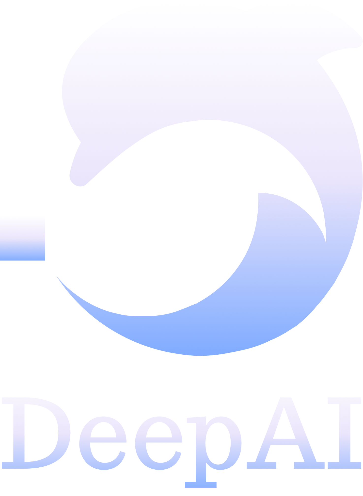

# Simian
A synthetic data generator for video caption pairs.


[](https://badge.fury.io/py/simian3d)
[](https://github.com/RaccoonResearch/simian/blob/main/LICENSE)
[](https://github.com/RaccoonResearch/simian)

Simian creates synthetic data that is usable for generative video and video captioning tasks. The data consists of videos and captions. The videos are generated using Blender, a 3D modeling software.

## 🖥️ Setup

> **_NOTE:_** Simian requires Python 3.11.

1. Install dependences:
```bash
pip install -r requirements.txt
```

2. Download the datasets:
```bash
./scripts/data/get_data.sh
```

3. [OPTIONAL] If you're on a headless Linux server, install Xorg and start it:

```bash
sudo apt-get install xserver-xorg -y && \
sudo python3 scripts/start_x_server.py start
```

## 📸 Usage

### Generating Combinations

Generate scenes without movement (static videos): 
```bash
python3 -m simian.combiner --count 1000 --seed 42
```

Add movement to all or no objects (camera is stationary):
```bash
python3 -m simian.combiner --count 1000 --seed 42 --movement
```

Allow objects to be on top of each other (static or movement):
```bash
python3 -m simian.combiner --count 1000 --seed 42 --ontop
```

Make camera follow an object (camera follows object):
```bash
python3 -m simian.combiner --count 1000 --seed 42 --camera_follow
```

Randomly apply movement, object stacking, and camera follow effects:
```
python3 -m simian.combiner --count 1000 --seed 42 --random
```

### Generating Videos or Images

Configure the flags as needed:
- `--width` and `--height` are the resolution of the video.
- `--start_index` and `--end_index` are the number of videos in the combinations you want to run. 0-100 will compile all 100 videos.
- `--combination_index` is the index of the combination to render.
- `--output_dir` is the directory to save the rendered video.
- `--hdri_path` is the directory containing the background images.
- `--start_frame` and `--end_frame` are the start and end frames of the video.
- `--images` adding this will output images instead of video at random frames. Creates multiple images per combination of varying sizes
-  `blend_file <absolute path to blend file>` allows users to upload and use their own blend files as the terrain
- `animation_length` is a percentage from 0-100 which describes how fast the animation should occur within the frames

Or generate all or part of the combination set using the `batch.py` script:


### Generating Videos or Images

Run:
```
python3 simian/batch.py
```

#### Batched Option

To generate videos use the arrow keys and select enter. Then 

To generate a video(s): 
```bash
--start_index 0 --end_index 1000 --width 1024 --height 576 --start_frame 1 --end_frame 2
```

To generate an video(s) with your own blend file:
```bash
--start_index 0 --end_index 1000 --width 1024 --height 576 --start_frame 1 --end_frame 3 ---blend <absolute path to blend file>
```

To generate an image(s):
```bash
--start_index 0 --end_index 1000 --width 1024 --height 576 --start_frame 1 --end_frame 2 --images
```

#### Prompt Option

Must first embedd all the data

```
python3 server/server.py
```


### SimJSON Dataset Curation

Make captions more prompt friendly.

This is a multi-stage process:

> **_NOTE:_** Create a .env file and add your Google Generative Language API key / OpenAI API key

1. 200 rows of stationary objects:
```
python3 -m simian.combiner --count 200 --seed 32
```

2. 200 rows of moving objects:
```
python3 -m simian.combiner --count 200 --seed 42 --movement
```

3. 150 (reduces to 50) rows of ontop objects:
```
python3 -m simian.combiner --count 150 --seed 21 --ontop
python3 scripts/filter/get_ontop_captions.py 
```

4. 150 movement with camera_follow:
```
python3 -m simian.combiner --count 150 --seed 80 --movement --camera_follow
```

5. 2000 truly all random
```
python3 -m simian.combiner --count 1000 --seed 37 --random
python3 -m simian.combiner --count 1000 --seed 1 --random
```

Run the following commands bellow after each combination is genereated: 

What the scripts are doing in order:
- add placeholder values (saved  to combinations_processed.json)
- get captions to rewrite (gets captions from combinations.json and saves to get_captions_<index>.json in batches of 500 combinations)
- rewrite captions with Google's Gemini (choose a prompt template)
```
python3 scripts/filter/combinations_add_placeholder.py

python3 scripts/filter/get_captions.py

python3 scripts/filter/rewrite_captions_gem.py OR python3 scripts/filter/rewrite_captions_gpt.py
```

### Distributed rendering
Rendering can be distributed across multiple machines using the "simian.py" and "worker.py" scripts.

You will need to set up Redis and obtain Huggingface API key to use this feature.

#### Set Up Redis
You can make a free Redis account [here](https://redis.io/try-free/).

For local testing and multiple local workers, you can use the following script to set up a local instance of Redis:
```bash
scripts/setup_redis.sh
```

#### Huggingface API Key

You can get a Huggingface API key [here](https://huggingface.co/settings/tokens).

Now, start your workers
```bash
export REDIS_HOST=<myhost>.com
export REDIS_PORT=1337
export REDIS_USER=default
export REDIS_PASSWORD=<somepassword>
export HF_TOKEN=<token>
export HF_REPO_ID=<repo_id>
celery -A simian.worker worker --loglevel=info
```

You can also build and run the worker with Docker
```bash
# build the container
docker build -t simian-worker .

# run the container with .env
docker run --env-file .env simian-worker

# run the container with environment variables
docker run -e REDIS_HOST={myhost} -e REDIS_PORT={port} -e REDIS_USER=default -e REDIS_PASSWORD={some password} -e HF_TOKEN={token} -e HF_REPO_ID={repo_id} simian-worker
```

Finally, issue work to your task queue

```bash
python3 -m simian.distributed --width 1024 --height 576
```

If you want to use a custom or hosted Redis instance (recommended), you can add the redis details like this:
```bash
export REDIS_HOST=<myhost>.com
export REDIS_PORT=1337
export REDIS_USER=default
export REDIS_PASSWORD=<somepassword>
```

To run all tests

```
python3 -m simian.tests.__run__
```

To run tests look into the test folder and run whichever test file you want

```bash
python3 -m simian.tests.object_test
```

## 📁 Datasets

We are currently using the following datasets:
[Objaverse](https://huggingface.co/datasets/allenai/objaverse)

Backgrounds are loaded from:
[Poly Haven](https://polyhaven.com)

## 🦝 Contributing

We welcome contributions! We're especially interested in help adding and refining datasets, improving generation quality, adding new features and dynamics and allowing the project to meet more use cases.

### How to contribute

1. Check out the issues <a href="https://github.com/DeepAI-Research/Simverse/issues">here</a>. 
2. Join our Discord <a href="https://discord.gg/JMfbmHdPNB">here</a>.
3. Get in touch with us so we can coordinate on development.
4. Or, you know, just YOLO a pull request. We're pretty chill.

## 📜 License

This project is licensed under the MIT License - see the [LICENSE](LICENSE) file for details.

If you use it, please cite us:

```bibtex
@misc{Simverse,
  author = {Deep AI, Inc},
  title = {Simverse: A Synthetic Data Generator for Video Caption Pairs},
  year = {2024},
  publisher = {GitHub},
  howpublished = {\url{https://github.com/DeepAI-Research/Simverse}}
}
```

## Contributors ✨

<!-- ALL-CONTRIBUTORS-BADGE:START - Do not remove or modify this section -->
[](#contributors-)
<!-- ALL-CONTRIBUTORS-BADGE:END -->

This project follows the [all-contributors](https://github.com/all-contributors/all-contributors) specification. Contributions of any kind welcome!

<!-- ALL-CONTRIBUTORS-LIST:START - Do not remove or modify this section -->
<!-- prettier-ignore-start -->
<!-- markdownlint-disable -->
<table>
  <tbody>
    <tr>
      <td align="center" valign="top" width="14.28%"><a href="https://ericsheen.tech/"><br /><sub><b>Eric S</b></sub></a><br /><a href="#infra-lalalune" title="Infrastructure (Hosting, Build-Tools, etc)">🚇</a><a href="https://github.com/DeepAI-Research/Simverse/commits?author=eric-prog" title="Code">💻</a> <a href="https://github.com/DeepAI-Research/Simverse/commits?author=eric-prog" title="Tests">⚠️</a> <a href="https://github.com/DeepAI-Research/Simverse/commits?author=eric-prog" title="Documentation">📖</a></td>
      <td align="center" valign="top" width="14.28%"><a href="https://github.com/lalalune"><br /><sub><b>M̵̞̗̝̼̅̏̎͝Ȯ̴̝̻̊̃̋̀Õ̷̼͋N̸̩̿͜ ̶̜̠̹̼̩͒</b></sub></a><br /><a href="#infra-lalalune" title="Infrastructure (Hosting, Build-Tools, etc)">🚇</a> <a href="https://github.com/DeepAI-Research/Simverse/commits?author=lalalune" title="Code">💻</a> <a href="https://github.com/DeepAI-Research/Simverse/commits?author=lalalune" title="Tests">⚠️</a> <a href="https://github.com/DeepAI-Research/Simverse/commits?author=lalalune" title="Documentation">📖</a></td>
    </tr>
  </tbody>
</table>

<!-- markdownlint-restore -->
<!-- prettier-ignore-end -->

<!-- ALL-CONTRIBUTORS-LIST:END -->

## Sponsors

<p style="text-align: center; margin-left: auto; margin-right: auto; max-width:800px;">
<center>Deep AI Research is sponsored by the following organizations:</center>
</p>
<p style="text-align: center; margin-left: auto; margin-right: auto; max-width:800px;">
<center></center>
</p>
<p style="text-align: center; margin-left: auto; margin-right: auto; max-width:800px;">
<center>Interested in working with us? Join our <a href="https://discord.gg/JMfbmHdPNB">Discord</a> or post an <a href=https://github.com/DeepAI-Research/Simverse/issues/new">issue</a> to get in touch.</center>
</p>
